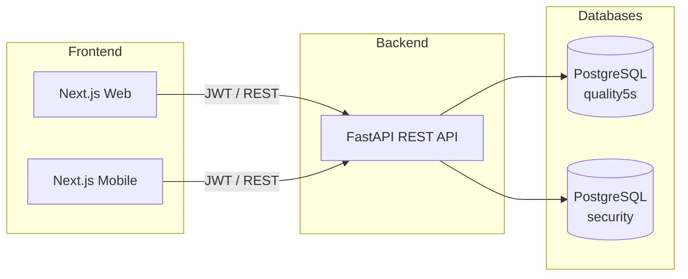
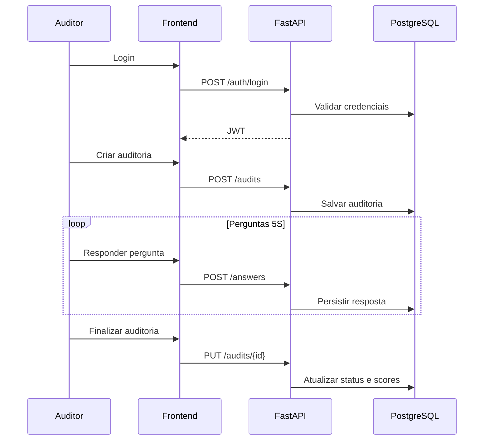
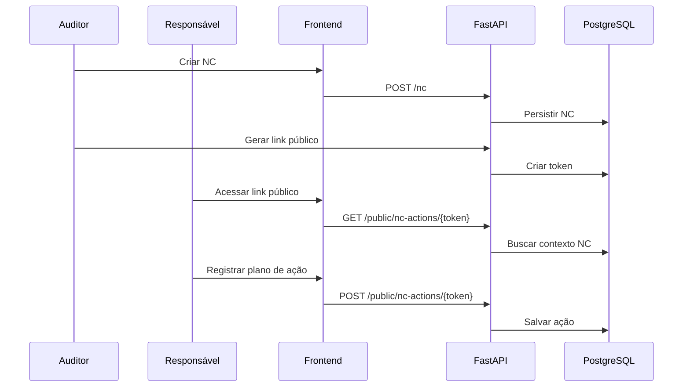

# Diagramas – 5S De Sangosse

## Arquitetura Geral (Mermaid)

```mermaid
flowchart LR
    subgraph Frontend
        A[Next.js Web]
        B[Next.js Mobile]
    end

    subgraph Backend
        C[FastAPI REST API]
    end

    subgraph Databases
        D[(PostgreSQL<br/>quality5s)]
        E[(PostgreSQL<br/>security)]
    end

    A -->|JWT / REST| C
    B -->|JWT / REST| C
    C --> D
    C --> E
```

## Fluxo de Auditoria 5S

```mermaid
sequenceDiagram
    participant U as Auditor
    participant F as Frontend
    participant API as FastAPI
    participant DB as PostgreSQL

    U->>F: Login
    F->>API: POST /auth/login
    API->>DB: Validar credenciais
    API-->>F: JWT

    U->>F: Criar auditoria
    F->>API: POST /audits
    API->>DB: Salvar auditoria

    loop Perguntas 5S
        U->>F: Responder pergunta
        F->>API: POST /answers
        API->>DB: Persistir resposta
    end

    U->>F: Finalizar auditoria
    F->>API: PUT /audits/{id}
    API->>DB: Atualizar status e scores
```

## Fluxo de Não Conformidade e Plano de Ação

```mermaid
sequenceDiagram
    participant U as Auditor
    participant R as Responsável
    participant F as Frontend
    participant API as FastAPI
    participant DB as PostgreSQL

    U->>F: Criar NC
    F->>API: POST /nc
    API->>DB: Persistir NC

    U->>API: Gerar link público
    API->>DB: Criar token

    R->>F: Acessar link público
    F->>API: GET /public/nc-actions/{token}
    API->>DB: Buscar contexto NC

    R->>F: Registrar plano de ação
    F->>API: POST /public/nc-actions/{token}
    API->>DB: Salvar ação
```
